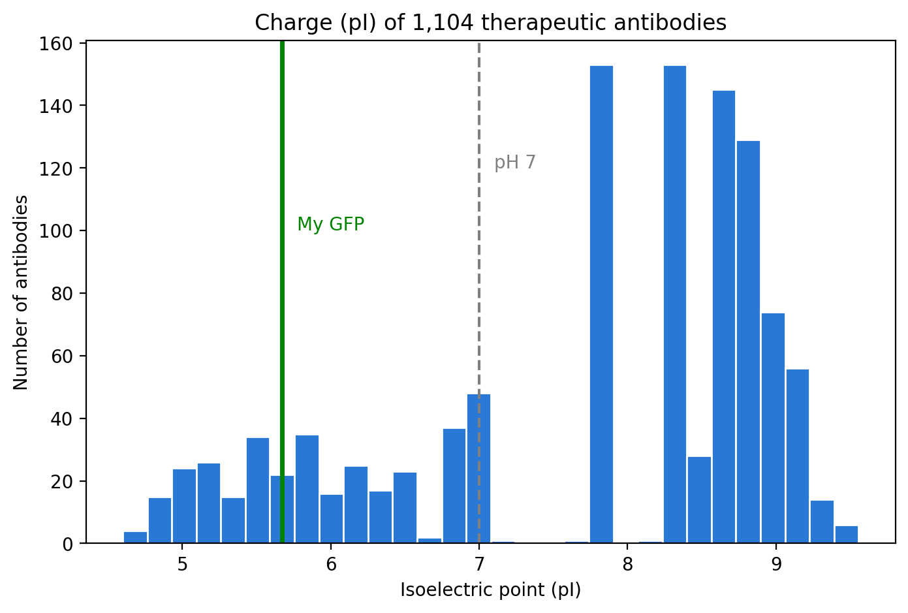
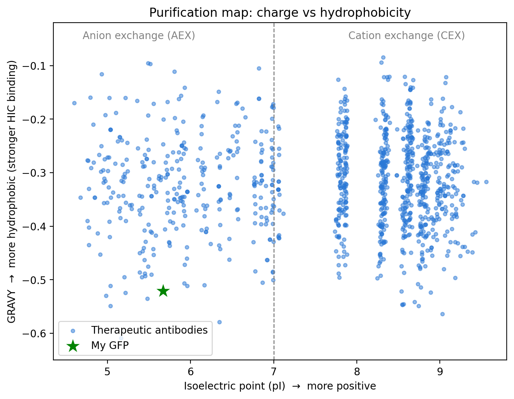

# From Bench to Screen: Predicting Antibody Purification Behavior from Sequence

**Author:** Veda Gandham, MS Biotechnology, Worcester Polytechnic Institute (WPI)

## Why I did this
In the lab, I purified GFP using hydrophobic interaction chromatography (HIC) on an ÄKTA system. That made me curious: how would therapeutic antibodies behave on the same kinds of columns? Charge drives ion exchange (IEX) and hydrophobicity drives HIC, and both can be estimated from the amino acid sequence. So I taught myself Python to find out.

## What I did
1. Downloaded the Thera-SAbDab database (University of Oxford) of 1,133 therapeutic antibodies with their sequences
2. Filtered out entries with missing or incomplete sequences, leaving **1,104 antibodies**
3. Joined the heavy- and light-chain variable regions (Fv) of each antibody
4. Used **Biopython** to calculate:
   - **Isoelectric point (pI)**, which predicts IEX behavior
   - **GRAVY hydrophobicity score**, a sequence-based proxy for HIC behavior
5. Calculated the same values for **GFP** as a reference point from my own bench work
6. Visualized the results with **matplotlib**

## Key findings
- About **70% of therapeutic antibodies have a pI above 7**, so most are positively charged at neutral pH. This is consistent with cation exchange (CEX) being widely used in antibody purification.
- **GFP (pI 5.67)** is negatively charged at neutral pH, so it suits anion exchange (AEX) instead.
- **98.7% of antibodies are more hydrophobic than GFP** (average antibody GRAVY −0.317 vs. GFP −0.521), suggesting most antibodies would bind an HIC column more strongly than GFP does.

## Charts

### Charge distribution of 1,104 therapeutic antibodies

### Purification map: charge vs. hydrophobicity

## Limitations
- pI and GRAVY are calculated from the variable regions only; the constant regions are similar across most antibodies.
- GRAVY is an average over the whole sequence. Real HIC behavior depends on hydrophobic patches on the folded protein's surface, so this is a first-pass screen, not a replacement for experiments.
- The GFP sequence is wild-type *Aequorea victoria* GFP (UniProt P42212); lab GFP variants differ by a few mutations.

## Tools
Python · pandas · Biopython · matplotlib · Google Colab

## Data sources
- Thera-SAbDab: Raybould et al., *Nucleic Acids Research* (2020). https://opig.stats.ox.ac.uk/webapps/sabdab-sabpred/therasabdab/
- GFP sequence: UniProt entry P42212

## How to run
Open `Antibody_Purification_Project.ipynb` in Google Colab, download the CSV from the Thera-SAbDab link above, upload it to Colab, and select Runtime → Run all.

## Next steps
- Apply a protein language model (ESM-2) to the same antibodies
- Compare approved vs. discontinued antibodies
